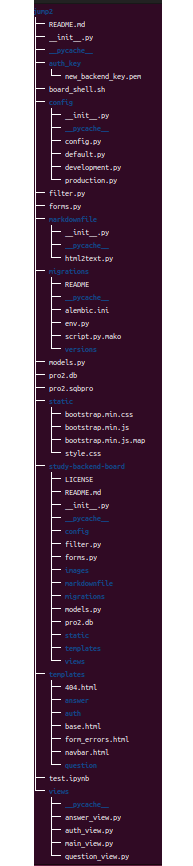
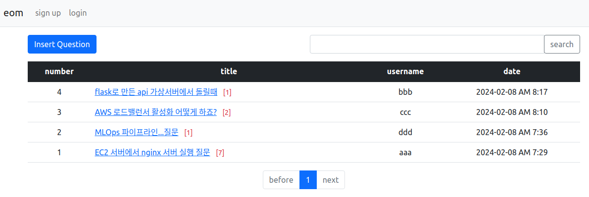
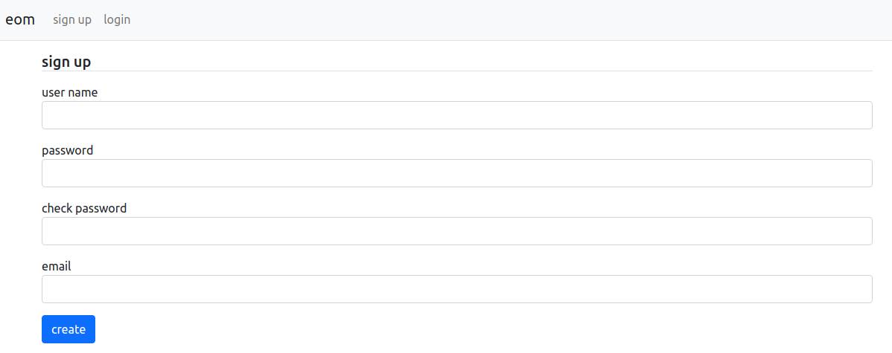
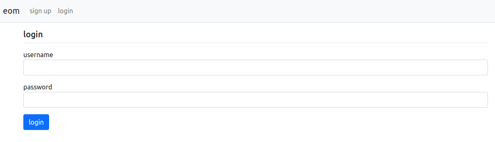
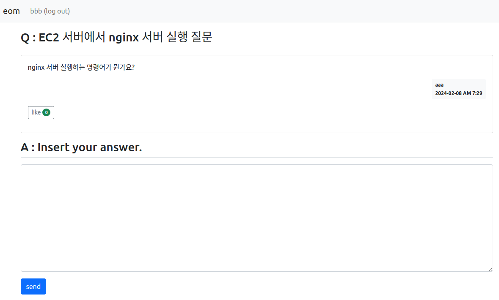
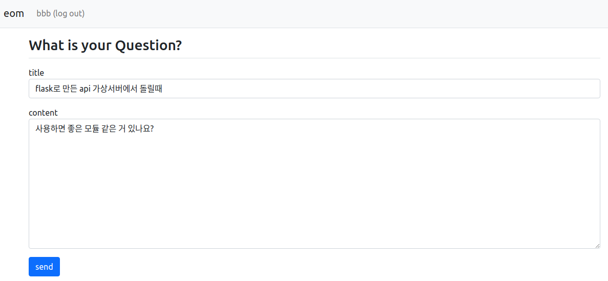
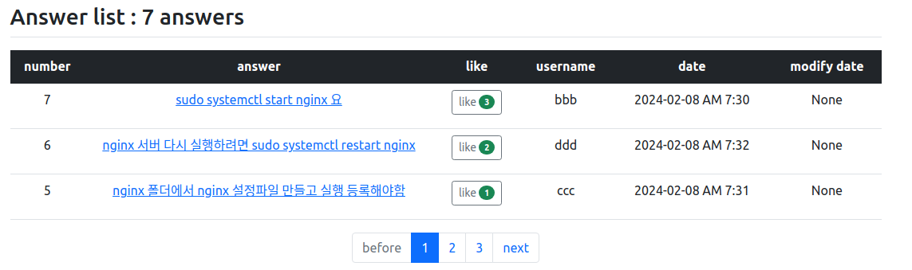
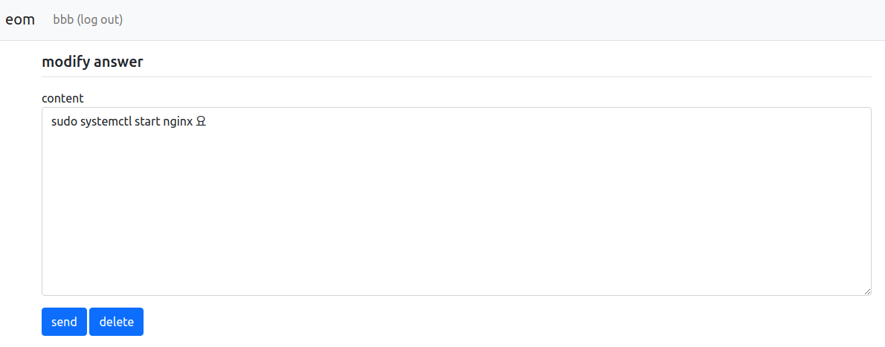

# 백엔드 개발 프로젝트 2
- Flask, Bootstrap, AWS를 사용한 미니 board 서비스 개발
   - <점프 투 플라스크> 참고

## 서비스 개요
- 회원가입, 로그인, 질문, 답변, 좋아요 기능을 사용할 수 있는 미니 게시판 웹 서비스 

## 서비스 구조
- Flask 프레임워크를 사용한 REST API 기반의 HTTP 요청, 응답 방식 서비스 구현
- SQLiteBrowser 라이브러리를 사용하여 DB를 구축하고 ORM을 사용하여 DB 컨트롤
- HTML 방식으로 웹 페이지를 구성하고 Bootstrap을 사용하여 스타일 적용
- 메인, 회원가입, 로그인, 질문 상세, 답변 상세 페이지로 구조화
- AWS의 EC2 가상 서버에서 Nginx와 Gunicorn 서버를 사용하여 동적, 정적 페이지 구현 및 배포

## 소스코드 구조
- __init__.py : DB 접속 객체, 팩토리 함수 내부에 flask 객체와 migrate 설정, 각각의 blueprint를 임포트
- config : 환경변수 디렉토리로 디폴트 파일을 기준으로 서버, 개발 환경에서의 파일 등을 구분하여 관리
- views : 엔드포인트 디렉토리로 main, question, answer, auth 파일 등을 구분하여 관리
- templates : html 디렉토리로 base, question, answer, auth, form_error 등의 html 파일 관리
- static : 정적 파일 디렉토리로 bootstrap의 css, js 파일 등을 관리
- models.py : ORM 기반으로 설정한 DB의 테이블 스키마 생성 파일
- froms.py : Flask의 Form 라이브러리를 사용하여 유저가 입력하는 값을 효율적으로 관리하는 파일
- filter.py : 게시판의 컨텐츠를 생성하거나 수정한 시각을 표준화하기 위한 필터 함수 파일

## 소스코드 설명

### 1) __init__.py
- SQLAlchemy를 사용하여 DB 객체와 python 모델로 테이블 작업을 가능하게 하는 Migrate 객체 생성
- 팩토리 함수 create_app() 에서 flask 객체를 만들고 ORM, blueprint, filter, error 기능을 속성으로 설정
- flask의 jinja_env 기능을 사용하여 모든 페이지에서 DATE의 필터링을 위한 filter 모듈을 일괄 적용

### 2) Config
- default, development, production 파일로 구분하고 로컬 또는 가상서버에서 서비스를 배포할 때 사용할 변수를 다르게 설정하여 효율적으로 관리하도록 구현

### 3) Views
- flask 의 blueprint 기능을 사용하여 여러가지 엔드포인트들을 구현하고 효율적으로 관리 
- init 파일에서 blueprint를 임포트 후 app객체에 저장, blueprint의 이니셜 네임으로 간편하게 사용
- paginate 객체를 만들고 질문 리스트와 답변 리스트 html 에 인수로 전달

### 4) Templates
- base html의 기능을 question, answer, auth html에서 상속
- form html에서 error를 확인하고 메시지를 반환하도록 구현한 후 각 html 파일에서 임포트하여 사용
- view 파일에서 paginate 객체를 사용하여 자동 index 넘버, 페이지 이동 버튼 구현

### 5) models.py
- DB 객체를 임포트하여 question, answer, user 테이블을 클래스로 생성
- question, answer의 like 데이터를 저장하는 N:N 구조의 테이블 생성 후 각 테이블과 연결
- relationship 속성으로 테이블을 연결하고 backref 인수를 설정하여 역참조 기능 사용

### 6) forms.py
 - Flask의 From 라이브러리를 사용하여 질문, 답변, 회원가입, 로그인 입력 데이터를 효율적으로 관리
 - 엔드포인트에서 form 객체의 validate_on_submin() 속성으로 로그인 여부를 확인하고,  populate_obj() 속성을 사용하여 글 수정 시 새로운 데이터를 쉽게 업데이트 가능

### 7) AWS 가상 서버에 서비스 배포 
 - EC2 가상서버를 생성하고 GitHub으로부터 소스코드 다운로드 후 배포
 - 동적 페이지 구현을 위해 WSGI 서버인 Gunicorn 서버를 사용하여 Flask에서 처리
 - 정적 페이지 구현을 위해 Nginx 서버를 사용하여 Falsk의 내장 웹 서버에서 처리

## Gunicorn, Nginx 설정 

### 1) gunicorn 설정
- AWS의 EC2 가상서버에서 동적 페이지 요청을 처리하기 위해 WSGI 서버인 Gunicorn 사용
- ubuntu 환경은 unix 계열의 시스템이므로 socket을 사용하여 api 실행하면 성능이 향상됨
   - gunicorn --bind unix:/tmp/jump2 "jump2:create_app()"
   - 소스코드의 실행 위치 즉 디렉토리 명(jump2)과, flask 팩토리 함수를 정확하게 지정해줘야함
   - 단 gunicorn의 socket을 사용하게되면 Nginx 서버를 사용하여 WSGI 서버에 접속할 수 있음
- gunicorn service 파일 생성
   - system의 서비스 파일로 등록하여 동작을 쉽게 할 수 있게 함
   - 환경변수 파일을 만든 후 gunicorn service 파일의 설정에 입력
      - jump2.env : Flask 실행시 명령어들
   - /etc/systemd/system/jump2.service
      - gunicorn 실행 관련 설정 명령어들 : 환경변수, 그룹, 실행시작 위치, 워커 갯수 등
      - gunicorn 홈페이지에서 설정사항들을 확인할 수 있음
   - 소스코드의 디렉토리 위치, 환경변수의 위치설정, gunicorn service 파일의 설정이 같아야 함
- gunicorn service 파일 시스템의 서비스 파일로 등록
   - sudo systemctl start jump2.service
- gunicorn service 파일 실행
   - sudo systemctl start jump2.service
   - 서비스 파일을 실행하면 jump2.socket 파일도 실행됨, 이 socket이 실행되어야 gunicorn도 제대로 작동함
   - http://<현재 서버의 IP>:5000

### 2) Nginx 설정
- Nginx는 웹 브라우저에서 정적, 동적 페이지 요청을 처리하는 웹 서버로, 정적 페이지 요청에 응답하고, 동적 페이지 요청은 WSGI 서버인 Gunicorn이 처리하도록 함
- gunicorn 설정을 기반으로 nginx의 파일을 설정
- nginx 디렉토리
   - /etc/nginx/sites-available 디렉토리 : 설정 파일을 저장하는 디렉토리
   - /etc/nginx/sites-enable 디렉토리 : 필요한 설정 파일을 활성화 하는 디렉토리
- nginx 설정 파일 설정
   - /etc/nginx/sites-avilable 디렉토리에 jump2라는 파일 생성(확장자명은 따로 없음)
   - nginx 설정 관련 명령어 입력
      - listen : port
      - server_name : 현재 서버의 IP 주소 (EC2 재실행시 IP 주소가 바뀌므로 고정 된 것이 아니면 직접 입력하여 변경)
      - location/static{서비스의 static 파일 위치} : static 요청 시 처리할 파일 위치
      - location/{include proxy_params; proxy_pass http://unix:/tmp/jump2.sock} : 동적 요청 시 gunicorn의 socket으로 flask에 연결하여 처리
- nginx 설정 파일 활성화
   - sudo ln -s /etc/nginx/sites-available/jump2
   - sites-enalbe 디렉토리에 jump2 설정파일이 활성화 됨
- nginx.conf 파일에서 시스템 환경의 유저명 및 group명 설정
   - sudo find / -name nginx.conf : 파일 찾기
   - user 라인에 현재 환경의 유저와 group명 입력
      - user ubuntu ubuntu ; 
- 방화벽 설정 문제 발생시
   - EC2의 보안그룹에서 Nginx 연결 포트 번호에 대한 방화벽을 해제 해야함
   - 인바운드 규칙 설정에서 Nginx 연결 포트에 대한 규칙을 생성
- nginx 서버 실행
   - sudo systemctl start nginx : nginx 실행
   - sudo systemctl status nginx : nginx 상태
   - sudo systemctl stop nginx : nginx 중지
   - sudo systemctl restart nginx : nginx 재실행
   - nginx 서버를 실행하면 gunicorn 서버와 socket이 함께 실행 됨
      - sudo systemctl status jump2.service, sudo systemctl status jump2.socket
   - http://<현재 서버의 IP> 
- EC2 가상서버의 트래픽 또는 저장공간 문제가 생기면 nginx 서버 실행이 잘 안될 수 있음

## 서비스 실행

### Main page

### Sign-up page

### Login page

### Question Detail page

### Question Modify page

### Answer List page

### Answer Modify page

## branch
- branch 별로 새로운 기능을 추가하고 해당 기능에 대한 설명

### board_x_1
- 질문에 대한 답변의 갯수가 늘어날 경우 페이징 기능이 추가된 답변 리스트로 업그레이드 함
- 답변에 좋아요가 추가되면 좋아요 갯수가 많은 순서데로 답변 리스트를 정렬하도록 업그레이드 함
